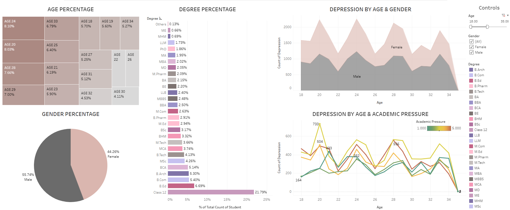
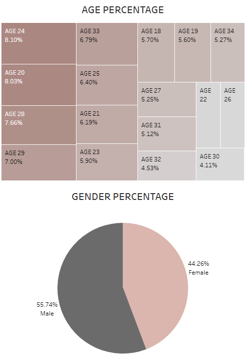
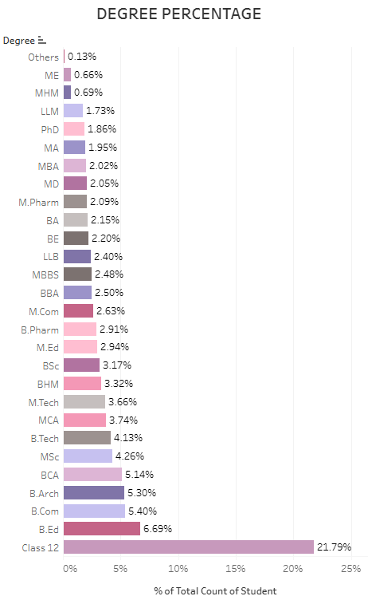
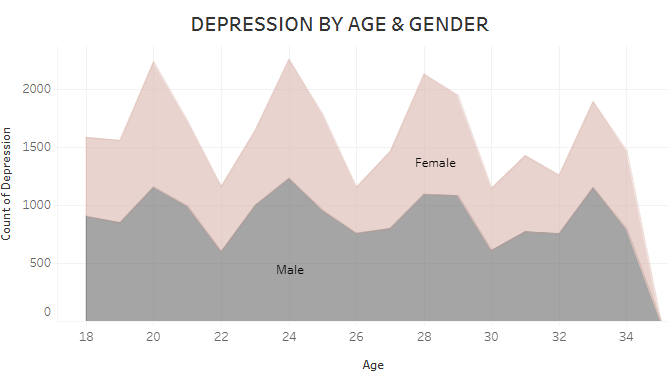
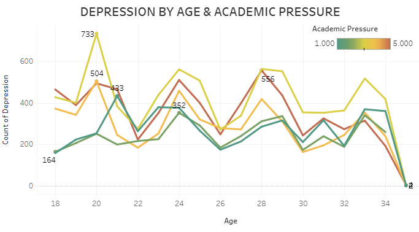

<h1 align="center">
     :disappointed_relieved: Student Depression Dashboard in Tableau
       
      

     📊 Data Visualization
</h1>
<h3>💡 Introduction</h3>

A student depression dataset provides valuable insights for analyzing, understanding, and predicting depression levels among students. It typically includes features such as demographic details (age, gender), academic performance (grades, attendance), lifestyle habits (sleep patterns, exercise, social activities), mental health history, and standardized depression scale responses.
 
Using this dataset, a dashboard was created in Tableau, offering an intuitive and interactive way to explore the data. The dashboard visualizes key metrics, such as Age Percentage, Gender Percentage, Degree Percentage, and analyzes depression trends with charts like Depression by Age and Gender and Depression by Age and Academic Pressure. A specific filter was applied to focus on individuals aged between 18 and 35 years, and the dashboard includes filtering capabilities by age and gender, allowing users to dynamically adjust the visualizations based on these parameters.

📍 The dataset is available via the following link: <a href="https://www.kaggle.com/datasets/hopesb/student-depression-dataset">Kaggle Link</a>.

📍 Live Dashboard: <a href="https://public.tableau.com/views/StudentDepression_17344379049530/Dashboard?:language=en-US&:sid=&:redirect=auth&:display_count=n&:origin=viz_share_link">Tableau Link</a>

  
<h3>:mag_right: Key Visualizations and Insights</h3>
<ol>
  <b><li>Age & Gender Percentage</li></b>
  
  
Individuals aged <b>24 years</b> represent the largest group, accounting for <b>8.10%</b> of the dataset, followed by those <b>aged 20 years at 8.03%</b>.

  
The dataset is predominantly <b>male</b>, with <b>55.74%</b>.

  <b><li>Degree Percentage</li></b>
  
  
Among educational qualifications, the <b>majority of students (21.79%)</b> have completed <b>Class 12</b>, followed by <b>6.69% with a B.Ed.</b>, and others with degrees such as <b>B.Com and B.Arch</b>.

  <b><li>Depression by Age and Gender</li></b>
  
  
Women <b>aged 20</b> and <b>24 years</b> show the <b>highest exposure to depression</b>, with a noticeable <b>decline in exposure for women over 30 years</b>.   Men <b>aged 24 years</b> have the <b>highest depression exposure</b>, and this trend <b>continues strongly even beyond their 30s</b>.

  <b><li>Depression by Age and Academic Pressure</li></b>
  
  
The most significant number of students experiencing depression is <b>733, aged 20 years</b>, facing <b>3 out of 5 levels of academic pressure</b>.  For the same age group, students under minimal academic pressure <b>(1 out of 5)</b> are less than half this number.

</ol>
<h3>Conclusion</h3>

With interactive filtering options by age and gender, users can dynamically explore how different factors interact with mental health outcomes. These features make the dashboard a powerful tool for educators, counselors, and policymakers to address student mental health challenges more effectively.

